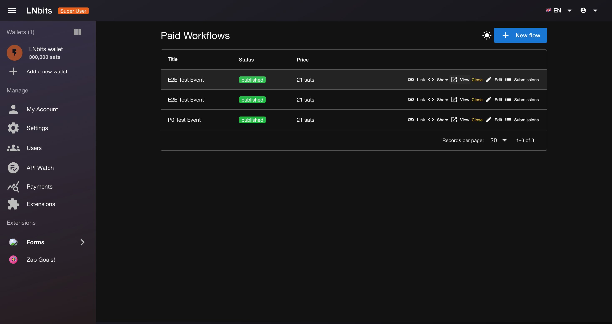
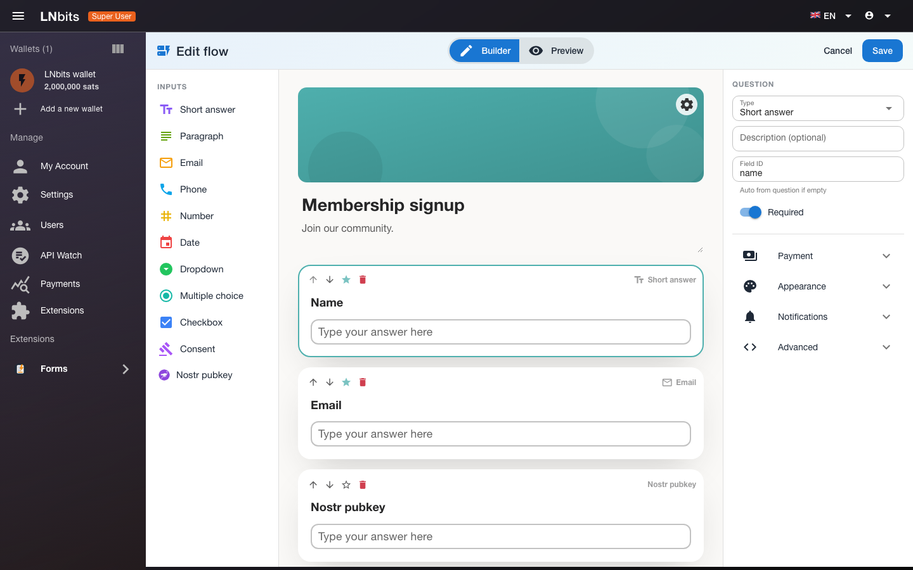
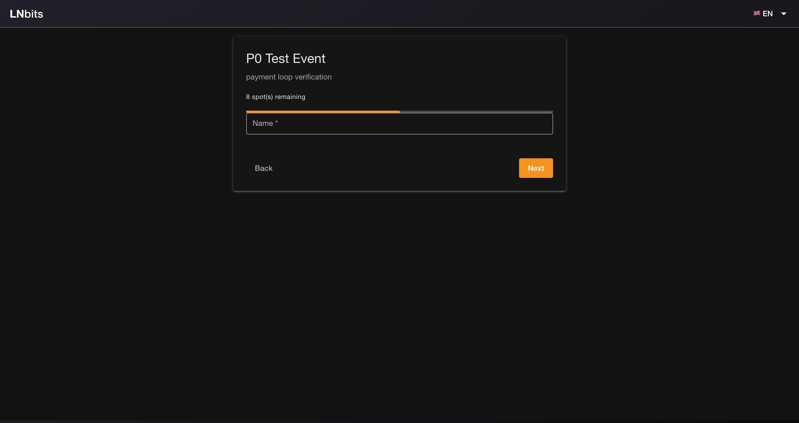
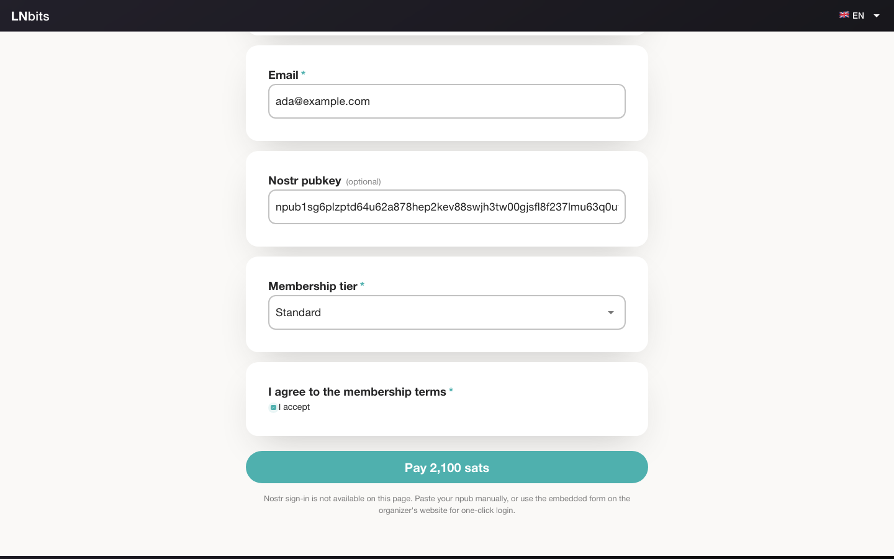
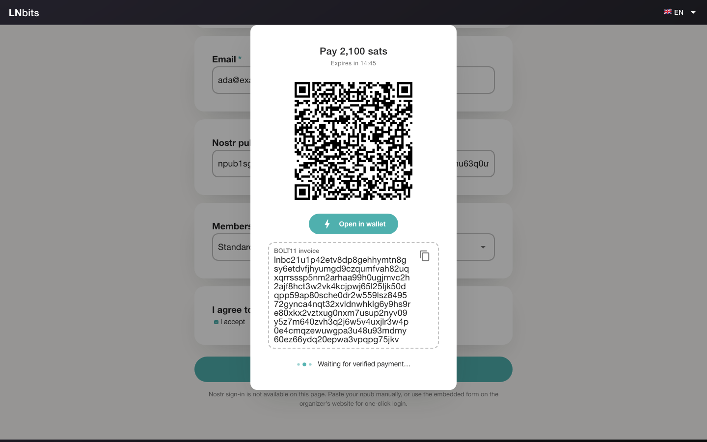
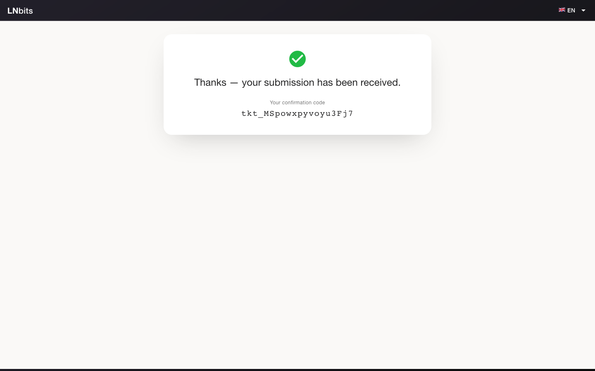
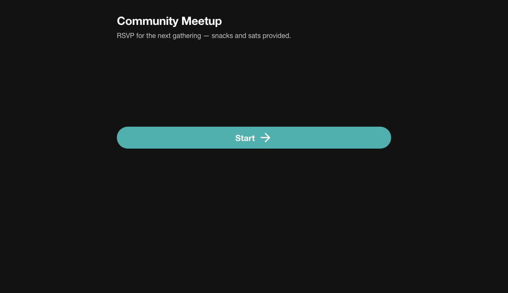
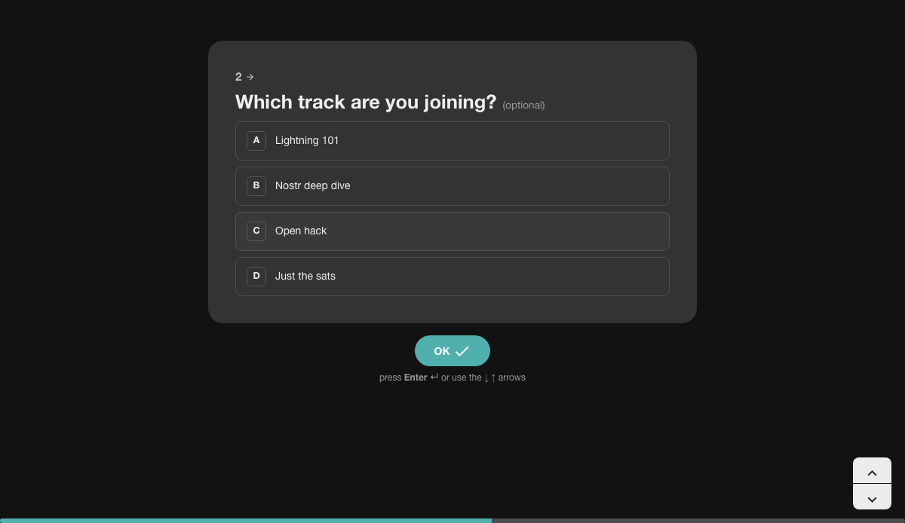
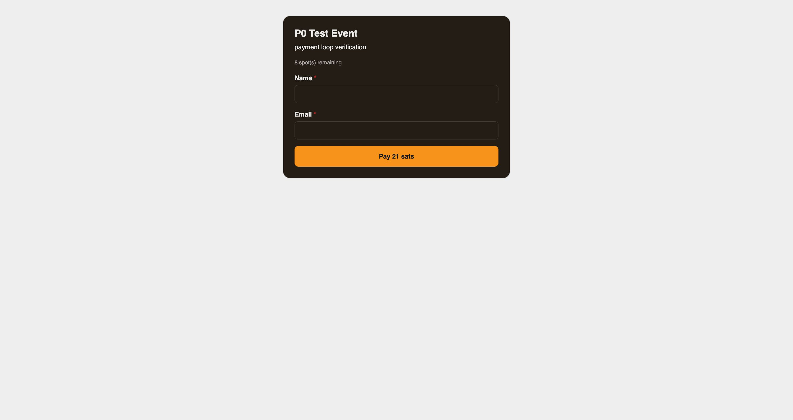

# Forms


Build paid registration forms, memberships, and workflows that get paid over
Bitcoin Lightning — a self-hostable WASM extension for
[LNbits](https://lnbits.com). Create a form, share the link or embed it on your
own site, and attendees pay a Lightning invoice to register. No Stripe account,
no third-party form service — your LNbits instance is the whole stack.

Forms is inspired by the familiar simplicity of **Google Forms** and the
focused, one-question-at-a-time experience of **Typeform** — reimagined for
self-hosted Lightning payments.

## What you can build

- **Event tickets & RSVPs** — capacity limits, automatic ticket codes per
  registrant
- **Paid memberships** — collect dues in sats, confirmed the moment the
  invoice settles
- **Form-based applications** — collect structured applications and review them
  first: optional manual approval before payment is accepted
- **Donations with signup** — supporter forms with custom amounts
- **Anything with fields** — text, email, phone, number, date, dropdowns,
  multiple choice, checkboxes, consent, Nostr pubkey

## Screenshots

<table>
  <tr>
    <td></td>
    <td></td>
  </tr>
  <tr>
    <td></td>
    <td></td>
  </tr>
  <tr>
    <td></td>
    <td></td>
  </tr>
  <tr>
    <td></td>
    <td></td>
  </tr>
</table>

The same form embedded on any website:

<p align="center"></p>

## Make it yours

- **5 theme presets** — Standard, Bitcoin, Minimal, High contrast, and a
  Typeform-style preset with one-question-at-a-time stepper layout
- **Light & dark modes** — independently of your LNbits admin theme
- **Full styling** — title/description/question colors, title image, page
  background, thank-you screen image, card transparency, and custom CSS
- **Nostr-friendly** — npub fields, plus one-click NIP-07 sign-in to prefill
  the form inside the embed widget
- **Notifications** — webhook on submit and on payment (Web3Forms for email,
  ntfy, Slack, Discord, Telegram, IFTTT)

## Getting started

1. **New flow** — pick a template (event registration, paid membership,
   donation, application) or start blank.
2. **Build** — add questions from the palette, mark required fields, set the
   price in sats and the payout wallet.
3. **Style** — choose a theme, mode, and layout in the Appearance panel; the
   canvas updates live.
4. **Publish** — one click takes the form live at a public URL.
5. **Share** — copy the public link, open the hosted page, or paste the
   embed snippet into your site.
6. **Collect** — submissions appear in the admin with status, amount, and
   ticket code. Export to CSV — one column per field.

## Embed on your website

The Share dialog generates a snippet like:

```html
<script src="https://YOUR-LNBITS/ext-assets/forms/js/embed.js"
        data-forms-origin="https://YOUR-LNBITS"
        data-flow="flow_..." async></script>
<div id="forms-embed"></div>
```

The widget renders the same themed form on any external page, including the
NIP-07 "Login with Nostr" prefill that isn't possible inside the LNbits frame.

## Install

Requires **LNbits 1.6.0 or newer** with WASM extension support.

1. Download `forms-0.1.0.zip` from the
   [latest release](https://github.com/bitkarrot/forms/releases/latest), or
   add this repo's `manifest.json` as an extension source in LNbits.
2. Install and review the requested permissions: extension storage, wallet
   list, public invoice creation for the payout wallet, and outbound HTTPS to
   your chosen notification hosts.
3. Open **Forms** in the sidebar and create your first flow.

## Developers

```bash
make build      # toolchain check, precompile Vue templates, cargo component build
make check      # JSON + cargo component check
make test       # config tests + native mock-host backend tests
make package    # deterministic dist/forms-<version>.zip
node tests/e2e_ui.mjs   # Playwright end-to-end (browser, needs playwright)
```

Design notes and the verified phase plan live in `PLAN.md`; release and
registry mechanics are documented in `AGENTS.md`. Layout follows
[zapgoalswasm](https://github.com/bitkarrot/zapgoalswasm).

---

Made by bitkarrot. MIT licensed.
